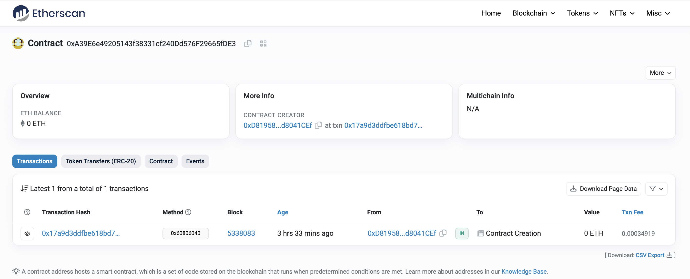

# 2024-Spring-HW0

All the detailed specified in Homework 0 documentation.

## Wallet Address
Please provide your MetaMask wallet address:
0xD8195870D1cf1942Ff9a8aB76A3fa01Fd8041CEf

## Local Testing
Please provide a screenshot of the `forge test -vvv` command running in your local environment.

## Contract Address
Please provide the contract address that you deployed on the Sepolia network.
deployed contract address: 0xA39E6e49205143f38331cf240Dd576F29665fDE3

## Sepolia Etherscan
Paste the contract address into the Sepolia Etherscan and share the screenshot.
contract address: 0x70551aa934aCFb52029d68F6eC7851dbe756A7E9

